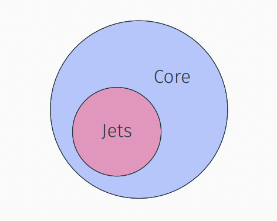
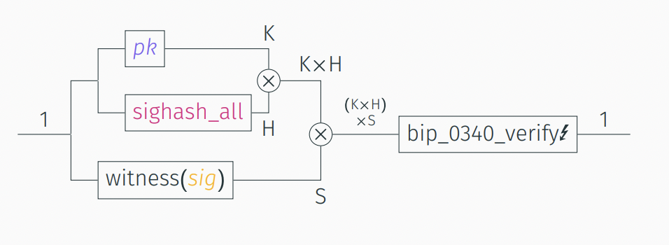
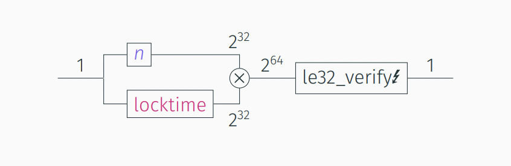

# Appendix: Functions + Simplicity

This is much easier than it first seems. The maths and fancy terms make it seem complicated, but Simplicity is actually much _simpler_ than many programming languages including Rust.

> If you are Rust developer, try the [Simplicity playground](https://github.com/uncomputable/simplicity-playground) (cloned in this repl).

## Types and Values

You have used types before. You are likely a developer who knows the difference between an integer and a string. You also know the difference between the number 1 and the integer type. Simplicity is the same.

> In the playground, check out `src/value.rs` and see how Simplicity types are just enum types with one or two possible values. Check out `examples/values.rs` to see values in action.

| Type   | Name    |
| ------ | ------- |
| 1      | Unit    |
| A + B  | Sum     |
| A × B  | Product |

There are three types in Simplicity. Actually, they are more like type constructors: You start with the unit type as a base. Then you arrange what you have in sum and product types, again and again, until you get the type that you want. This way we can build integer types, string types (of fixed length) and much more.

| Value  | Name    | Type  | Note |
| ------ | ------- | ----- | ---- |
| ·      | Unit    | 1     |      |
| L(a)   | Left    | A + B | a has type A |
| R(b)   | Right   | A + B | b has type B |
| (a, b) | Product | A × B | a has type A and b has type B |

There are four kinds of values in Simplicity. Again, they follow the recursive construction from before, so left and right values contain a smaller inner value, and product values contain a left and a right inner value.

To help with readability, we write types in uppercase and values in lower case. `1`, `+` and `×` can be thought of as keywords in the type language. `·`, `L( )`, `R( )` and `( , )` are keywords in the value language.

## Combinators

Values are useless without functions that change them. These are the combinators. A combinator is also called a program.

> In the playground, check out `src/combinator.rs` and see how combinators are defined. Check out `examples/combinators.rs` to see them in action.

| Combinator | Name                    | Note |
| ---------- | ----------------------- | ---- |
| unit       | Unit                    |      |
| iden       | Identity                |      |
| take(t)    | Take (left projection)  | t is combinator |
| drop(t)    | Drop (right projection) | t is combinator |
| injl(t)    | Left injection          | t is combinator |
| injr(t)    | Right injection         | t is combinator |
| pair(s, t) | Pair (product)          | s and t are combinators |
| comp(s, t) | Composition             | s and t are combinators |
| case(s, t) | Case                    | s and t are combinators |

Like types and values, the combinators are recursively built up from a base (unit and iden). You arrange what you have with other combinators until get the function that you want. There are some rules how combinators can be arranged, but I will not go into that here. A wrong arrangement yields a type error.

This scheme is extremely powerful. Every Boolean function from n bits to m bits can be computed with Simplicity. Every Turing machine that is guaranteed to halt _(important condition!)_ can be simulated in Simplicity. Every arithmetic circuit can be reconstructed in Simplicity.

This means we can hard-code any constant, compute any hash, do any elliptic-curve operation, etc. etc.

## Jets

The reduced instruction set of nine combinators means that meaningful programs tend to be large. This is problematic because block space is valuable, and evaluating such a large program also takes time. We can introduce shortcuts, which we call jets.

A jet consists of three parts:

1. The Simplicity program that it seeks to replace
2. The special combinator that we introduce for it
3. The C code that implements it

Instead of writing the long program, we write the special combinator, a single instruction. This instruction is executed by calling the C code.

To make sure that the replacement is equivalent, we formally prove that the C code is equivalent with the Simplicity program. The formal semantics of Simplicity and of [Verifiable C](https://vst.cs.princeton.edu/) let us do that.

Jets are can also be thought of as a design space for new opcodes. Consensus limits will ban almost all programs _(Core Simplicity)_, especially large ones. The way to get around this is by defining jets for the programs that we care about. This enables what we want while disabling what we don't want (namely DDOS).

## Introspection

Introspection into the execution environment (usually the spending transaction) is done via special jets. These jets don't replace any Simplicity program, but they call C code that introspects the environment. By choosing the set of jets, we choose the amount and kind of introspection we want.

## Circuit Representation

Nesting combinators is a bit like building a circuit. Turns out one can visualize Simplicity programs as circuits. The boxes are combinators. `(×)` stands for the pair combinator. `↯` means that the combinator may fail. The labels indicate the type of values that live on each wire. 

### Key Lock

### Time Lock

