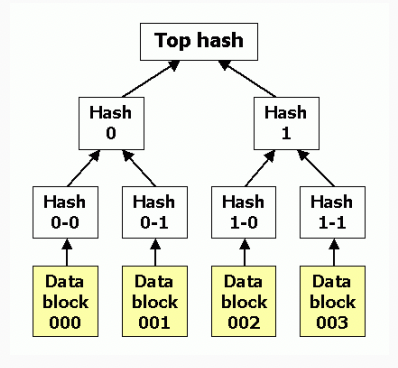
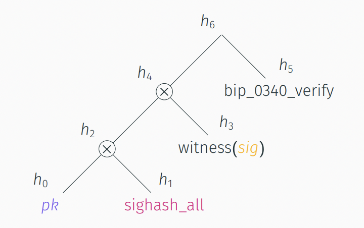
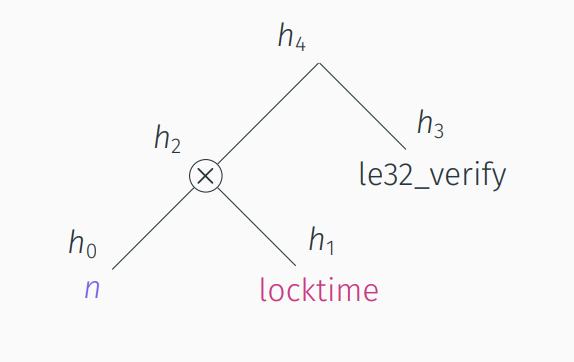
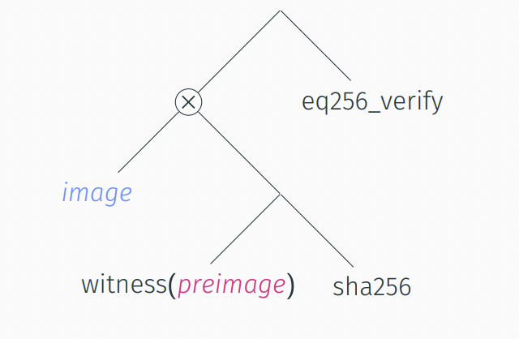

# Appendix: Trees + Simplicity

Simplicity programs are trees. In fact, Simplicity stems from the idea of [MAST](https://bitcoinops.org/en/topics/mast/) (also by Russell O'Connor, by the way). The idea is to do computations inside a tree structure.

## Merkle Tree

[Merkle trees](https://en.wikipedia.org/wiki/Merkle_tree) are everywhere in Bitcoin. They enable very efficient proofs that a value is member of the tree, without revealing the entire tree; so called Merkle proofs.

A Merkle tree is a tree of hashes: The leaves contain values and are labelled with the hash of their value. Parent nodes are labelled with the hash of the labels of their children. This means that the root label is a hash of all the values (and hashes) of the tree. We call this root hash the Merkle root of the tree. Any change to the values inside the tree changes the above hashes and therefore the Merkle root. The Merkle root is a compact and unique description of the contents of the tree.

## Merklized Abstract Syntax Tree (MAST)

Trees can be functions. If I take a leaf node, it can be a constant function, like a hard-coded function or the identity function. If I take a parent node, it can be a function that executes its children functions in a particular way. The parent creates a larger function out of the children functions. That sounds a lot like combinators.

An important difference to Merkle trees is that there are multiple possible parent nodes for each pair of children. We can choose this combinator or that. In Merkle trees, there was just one kind of parent with one kind of label. In MAST, which kind of parent you choose changes the function that the tree computes.

The Merkle root of the MAST is a compact and unique description of the function that the tree computes. Any change to the combinators inside the tree changes the Merkle root.

## Merklize All the Things

It turns out, we can do a lot with MAST.

The program identity at UTXO creation time is called its Commitment Merkle Root (CMR). This does not include the witness data, because the witness does not exist yet! When we spend the UTXO, adding witness data to the program changes it, but not its identity (CMR). This is how the program+witness can be identified as the program inside the UTXO.

During spending, there is another program identity called the Identity Merkle Root (IMR). It represents the program as it will be executed. If there are duplicate branches in the program, they have the same IMR and can be joined, reducing the program size. If there are unused branches, they can be hidden using the Merkle root instead of the underlying program. This is similar to how a Merkle proof includes just the closest hashes instead of the entire tree. Great for privacy and it further reduces the program size.

## Tree Representation

MAST yields a tree representation of Simplicity programs.

### Key Lock

### Time Lock

### Hash Lock

