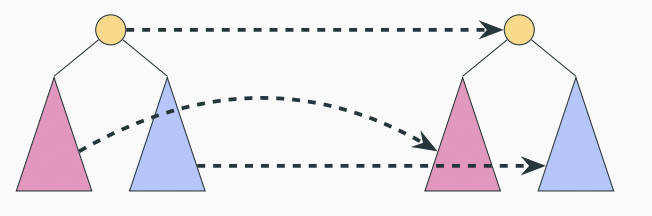

# Appendix: Miniscript + Simplicity

## Miniscript

Bitcoin Script is unnecessarily complicated. It is hard for humans _and for machines_ to process. Here is one of the most common contracts on Bitcoin, a Bolt 3 `offered` HTLC:

```
OP_DUP OP_HASH160 <RIPEMD160(SHA256(revocationpubkey))> OP_EQUAL
OP_IF
    OP_CHECKSIG
OP_ELSE
    <remote_htlcpubkey> OP_SWAP OP_SIZE 32 OP_EQUAL
    OP_NOTIF
        OP_DROP 2 OP_SWAP <local_htlcpubkey> 2 OP_CHECKMULTISIG
    OP_ELSE
        OP_HASH160 <RIPEMD160(payment_hash)> OP_EQUALVERIFY
        OP_CHECKSIG
    OP_ENDIF
OP_ENDIF
```

And here is the same contract written in Miniscript. Note how much easier it is to read.

```
t:or_c(
    pk(key_revocation),
    and_v(
        v:pk(key_remote),
        or_c(
            pk(key_local),
            v:hash160(H)
        )
    )
)
```

### Benefits of Structure

Rich program structure has tangible benefits. We can check if a program is correct, manually or automatically. We can check if a satisfying witness for a program is malleable. That means an attacker can change the witness without knowing the private key (blowing it up); an attack vector. We can take programs from two unrelated sources and combine them into a larger program. This enables the use of dependency programs inside larger ones. We can do other kinds of static analyis on programs, which means we check for certain properties by looking at the program. Programs are machine-readable, which means that they can be fed into automatic checkers or zero-knowledge systems, to name but a few applications.

All in all, structure gives you guarantees which give you peace of mind. You know that your program is correct, even it is large and consists of many sub-programs.

### Who Cares?

Still, you might be wondering who cares about these benefits. Turns out, quite a lot of people!

[The Bitcoin Core 24.0.1 wallet supports watch-only Miniscript descriptors](https://bitcoincore.org/en/releases/24.0.1/), and [more support for Miniscript is coming](https://github.com/bitcoin/bitcoin/pulls?q=is%3Apr+is%3Aopen+miniscript).

[BDK aims to be the first native descriptor library](https://bitcoindevkit.org/descriptors/) and Miniscript is tighly connected to descriptors.

[Liana is a wallet that uses Miniscript for timelocks](https://github.com/wizardsardine/liana). It can be [dangerous to use timelocks](https://medium.com/blockstream/dont-mix-your-timelocks-d9939b665094) because one can create unspendable utxos, but with Miniscript one can check if there is at least one spendable path.

[Ledger added Miniscript support to its hardware wallet](https://protos.com/what-is-miniscript/). This enables complex scripts with the guarantee of correctness.

Finally, _I_ care about Miniscript! [I wrote a developer-friendly descriptor wallet](https://github.com/uncomputable/tappy), and thanks to Miniscript I didn't need to deal with low level details like script_pub, script_sig and the witness. Miniscript is great!

## Simplicity

Simplicity is like Miniscript, but more. It brings arbitrary computation (see "Functions + Simplicity") and formal verification.

## Nine Combinators For the Mortal Men


There are nine combinators to build all Simplicity programs. They look a bit like puzzle pieces that fit into each other. Some pieces stand on their own _(unit, iden)_; some need one _(injl, injr, take, drop)_ or two _(pair, comp, case)_ other pieces.

## Combinators ≈ Miniscript Fragments


The Simplicity combinators look a lot like the [BDK Miniscript playground](https://bitcoindevkit.org/bdk-cli/playground/)! In fact, I took the assets from the playground and merely changed the names. 

Miniscript is tree-structured and so is Simplicity (see "Trees + Simplicity"). The difference is that Miniscript fragments have a high-level meaning like a public key, while Simplicity combinators have a low-level functional meaning.

## Miniscript → Simplicity



Miniscript and Simplicity are so similar that we can recursively convert a Miniscript program (tree) into a Simplicity program (tree). The Miniscript root becomes some Simplicity node, and the children are recursively converted.

(Miniscript) signature parts become (Simplicity) signature parts. (Miniscript) preimage parts become (Simplicity) preimage parts. Conjunctions (and), disjunctions (or) and thresholds are naively mapped. We can even convert the resulting Simplicity program back into the original Miniscript program. This backwards conversion does not work for general Simplicity programs.

[tappy](https://github.com/uncomputable/tappy/tree/simplicity) supports Simplicity descriptors (see "Elements + Simplicity") which implicitly perform this conversion. We are working on other tools that let you convert Miniscript into Simplicity and visualize the output.

## Lifting Semantics to Simplicity


Each Miniscript program has a meaning. Each Simplicity program has a meaning. Because Simplicity extends Miniscript, its meaning is strictly richer. This means that each Miniscript program has some associated Simplicity meaning. By _lifting_ Miniscript semantics to Simplicity semantics, we reach that meaning.

Not only can we syntactically convert Miniscript programs into Simplicity programs, but we can semantically compare their meaning! We can check if a Miniscript and Simplicity program have the same meaning, even if the two are completely unrelated. _(In particular, the Miniscript program converted into Simplicity is different from the Simplicity program that we compare with.)_ We can check if the meaning of a Miniscript program is subsumed by the meaning of a Simplicity program, and vice versa.

This close relationship between Miniscript and Simplicity makes it easy to jump between the two worlds and will likely spawn many tools in the future.
